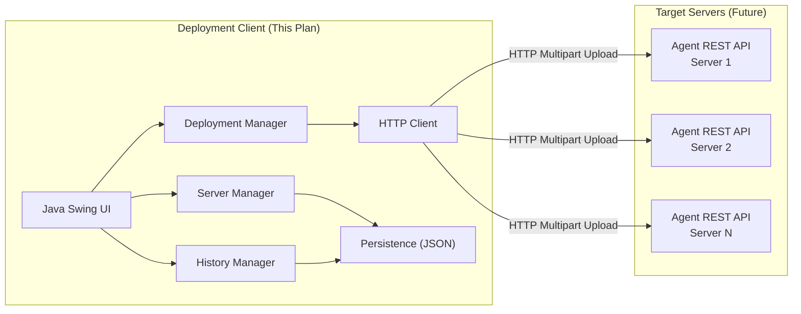

# CF Deployment Tool — Deployment Client

A Java 17 Swing desktop application for automating file deployments to multiple Windows servers via REST agents.

## Background

Currently, deployments are done manually by copying `.exe`, `.jar`, `.dll`, plugin JARs, and configuration files to multiple Windows servers. This tool automates that process by providing a single client UI that sends files to remote agents running on target servers.

**Scope of this plan**: Deployment Client only. The agent (server-side) will be built separately later.

---

## Architecture Overview



### Key Design Decisions

| Decision | Choice | Rationale |
|----------|--------|-----------|
| UI Framework | Java Swing | User preference; works with Java 17 out-of-the-box |
| Build Tool | None (Eclipse project) | User preference; simple setup |
| Communication | REST API over HTTP | Agents will run embedded HTTP servers |
| Persistence | JSON flat files | No database setup required |
| File Placement | Agent-controlled | Agent decides target paths based on file type |
| HTTP Client | `java.net.http.HttpClient` | Built into Java 11+; no external dependencies |
| JSON Library | Minimal hand-written JSON serializer | No external dependencies needed for simple data |
| Look & Feel | FlatLaf (via JAR) | Modern, professional look without external build tools |

> [!IMPORTANT]
> Since we're keeping this as a plain Eclipse project with no Maven/Gradle, all dependencies must either be from the JDK itself or added as JAR files to the classpath. The plan uses **only JDK built-in classes** to avoid JAR management complexity. Swing will use a custom dark theme via manual UI defaults instead of FlatLaf.

---

## Proposed Changes

### Package Structure

```
src/
└── com/
    └── cfdeploytool/
        ├── Main.java                          # Application entry point
        ├── model/
        │   ├── Server.java                    # Server data model
        │   ├── DeploymentFile.java             # Selected file data model
        │   ├── DeploymentRequest.java          # Deployment request model
        │   ├── DeploymentResult.java           # Per-file-per-server result
        │   └── DeploymentHistory.java          # History record model
        ├── service/
        │   ├── ServerManager.java             # CRUD for server registry
        │   ├── DeploymentService.java         # Orchestrates deployment
        │   ├── HttpDeploymentClient.java      # HTTP multipart file sender
        │   └── HistoryService.java            # Deployment history persistence
        ├── persistence/
        │   ├── JsonUtil.java                  # JSON serialization/deserialization
        │   └── FileStore.java                 # Read/write JSON files to disk
        └── ui/
            ├── MainFrame.java                 # Main application window
            ├── ThemeManager.java              # Dark theme & styling
            ├── panel/
            │   ├── ServerPanel.java           # Server management tab
            │   ├── DeployPanel.java           # File & server selection + deploy
            │   ├── ProgressPanel.java         # Live deployment progress
            │   └── HistoryPanel.java          # Deployment history viewer
            └── dialog/
                ├── AddServerDialog.java       # Add/edit server dialog
                └── DeploymentResultDialog.java # Detailed results view
```

---

### Models

#### [NEW] [Server.java](file:///d:/DEV/JAVA/CFDeploymentTool/src/com/cfdeploytool/model/Server.java)

Represents a registered target server.

| Field | Type | Description |
|-------|------|-------------|
| `id` | `String` | UUID |
| `name` | `String` | Display name (e.g., "Prod Server 1") |
| `host` | `String` | Hostname or IP address |
| `port` | `int` | Agent REST API port (default: 8585) |
| `description` | `String` | Optional notes |
| `status` | `ServerStatus` enum | `ONLINE`, `OFFLINE`, `UNKNOWN` |
| `lastChecked` | `LocalDateTime` | Last health check timestamp |

#### [NEW] [DeploymentFile.java](file:///d:/DEV/JAVA/CFDeploymentTool/src/com/cfdeploytool/model/DeploymentFile.java)

Wraps a selected local file for deployment.

| Field | Type | Description |
|-------|------|-------------|
| `file` | `File` | Local file path |
| `fileType` | `FileType` enum | `EXE`, `JAR`, `DLL`, `PLUGIN_JAR`, `CONFIG` |
| `sizeBytes` | `long` | File size |

#### [NEW] [DeploymentRequest.java](file:///d:/DEV/JAVA/CFDeploymentTool/src/com/cfdeploytool/model/DeploymentRequest.java)

Groups files + target servers into a single deployment job.

#### [NEW] [DeploymentResult.java](file:///d:/DEV/JAVA/CFDeploymentTool/src/com/cfdeploytool/model/DeploymentResult.java)

Captures the result of deploying one file to one server.

| Field | Type | Description |
|-------|------|-------------|
| `server` | `Server` | Target server |
| `file` | `DeploymentFile` | The file deployed |
| `status` | `ResultStatus` enum | `SUCCESS`, `FAILED`, `SKIPPED` |
| `message` | `String` | Details/error message |
| `timestamp` | `LocalDateTime` | When the deployment completed |

#### [NEW] [DeploymentHistory.java](file:///d:/DEV/JAVA/CFDeploymentTool/src/com/cfdeploytool/model/DeploymentHistory.java)

A persisted record of an entire deployment job.

---

### Services

#### [NEW] [ServerManager.java](file:///d:/DEV/JAVA/CFDeploymentTool/src/com/cfdeploytool/service/ServerManager.java)

- `addServer(Server)` — Register a new server
- `updateServer(Server)` — Edit server details
- `removeServer(String id)` — Delete server
- `getServers()` — List all registered servers
- `checkServerHealth(Server)` — Ping agent's `/health` endpoint, update status
- Persists servers to `data/servers.json`

#### [NEW] [DeploymentService.java](file:///d:/DEV/JAVA/CFDeploymentTool/src/com/cfdeploytool/service/DeploymentService.java)

- `deploy(DeploymentRequest, ProgressCallback)` — Orchestrates the deployment
- Iterates over files × servers, calls `HttpDeploymentClient` for each
- Reports progress via callback (for UI progress bar)
- Uses `ExecutorService` for parallel deployments to multiple servers
- Collects all `DeploymentResult` objects and saves history via `HistoryService`

#### [NEW] [HttpDeploymentClient.java](file:///d:/DEV/JAVA/CFDeploymentTool/src/com/cfdeploytool/service/HttpDeploymentClient.java)

- Uses `java.net.http.HttpClient` (Java 11+ built-in)
- `sendFile(Server, DeploymentFile)` → `DeploymentResult`
- Sends HTTP POST multipart/form-data to `http://{host}:{port}/api/deploy`
- Includes file bytes + metadata (file type, original filename)
- Handles timeouts, connection errors gracefully

#### [NEW] [HistoryService.java](file:///d:/DEV/JAVA/CFDeploymentTool/src/com/cfdeploytool/service/HistoryService.java)

- `saveDeployment(DeploymentHistory)` — Persists to `data/history/`
- `getHistory()` — Returns all past deployments (sorted newest first)
- `getHistoryById(String id)` — Load specific deployment details
- `clearHistory()` — Purge all history
- Each deployment is saved as a separate JSON file: `data/history/{id}.json`

---

### Persistence

#### [NEW] [JsonUtil.java](file:///d:/DEV/JAVA/CFDeploymentTool/src/com/cfdeploytool/persistence/JsonUtil.java)

Lightweight JSON serializer/deserializer using only JDK classes. Handles the simple flat models we need without requiring Gson/Jackson.

#### [NEW] [FileStore.java](file:///d:/DEV/JAVA/CFDeploymentTool/src/com/cfdeploytool/persistence/FileStore.java)

- `writeJson(Path, String)` — Write JSON string to file
- `readJson(Path)` → `String` — Read JSON string from file
- `listFiles(Path, String extension)` → `List<Path>`
- Creates `data/` directory tree on first run

---

### UI Components

#### [NEW] [Main.java](file:///d:/DEV/JAVA/CFDeploymentTool/src/com/cfdeploytool/Main.java)

Application entry point. Sets look-and-feel, creates `MainFrame`.

#### [NEW] [ThemeManager.java](file:///d:/DEV/JAVA/CFDeploymentTool/src/com/cfdeploytool/ui/ThemeManager.java)

Applies a custom dark professional theme by setting Swing `UIManager` defaults:
- Dark background (`#1e1e2e`), card surfaces (`#2a2a3d`)
- Accent color (`#7c3aed` — purple) for buttons, selections
- Modern fonts (Segoe UI on Windows)
- Custom borders, padding, and component styling

#### [NEW] [MainFrame.java](file:///d:/DEV/JAVA/CFDeploymentTool/src/com/cfdeploytool/ui/MainFrame.java)

Main window with a `JTabbedPane` containing:

| Tab | Panel | Purpose |
|-----|-------|---------|
| 🖥️ Servers | `ServerPanel` | Manage registered servers |
| 🚀 Deploy | `DeployPanel` | Select files + servers, initiate deployment |
| 📊 Progress | `ProgressPanel` | Live deployment tracking |
| 📋 History | `HistoryPanel` | Past deployment records |

Window: 1100×750, centered, titled "CF Deployment Tool"

#### [NEW] [ServerPanel.java](file:///d:/DEV/JAVA/CFDeploymentTool/src/com/cfdeploytool/ui/panel/ServerPanel.java)

- JTable listing all registered servers (Name, Host, Port, Status)
- Toolbar buttons: Add, Edit, Remove, Refresh Status
- Right-click context menu
- Status indicators (green/red/gray icons)
- Double-click to edit

#### [NEW] [DeployPanel.java](file:///d:/DEV/JAVA/CFDeploymentTool/src/com/cfdeploytool/ui/panel/DeployPanel.java)

Split layout:
- **Left**: File selection area
  - "Add Files" button opens `JFileChooser` with filters for `.exe`, `.jar`, `.dll`, and config files
  - Table showing selected files (name, type, size)
  - Remove selected files button
- **Right**: Server selection area
  - Checkboxes for each registered server
  - "Select All" / "Deselect All" buttons
- **Bottom**: "Deploy" button (enabled only when files AND servers are selected)

#### [NEW] [ProgressPanel.java](file:///d:/DEV/JAVA/CFDeploymentTool/src/com/cfdeploytool/ui/panel/ProgressPanel.java)

- Overall progress bar (files × servers)
- Per-server progress bars
- Real-time status text for each file deployment
- Color-coded results (green = success, red = failed)
- Auto-switches to this tab when deployment starts

#### [NEW] [HistoryPanel.java](file:///d:/DEV/JAVA/CFDeploymentTool/src/com/cfdeploytool/ui/panel/HistoryPanel.java)

- JTable: Date, # Files, # Servers, Success/Fail count, Overall status
- Double-click to open `DeploymentResultDialog` with full details
- "Clear History" button with confirmation

#### [NEW] [AddServerDialog.java](file:///d:/DEV/JAVA/CFDeploymentTool/src/com/cfdeploytool/ui/dialog/AddServerDialog.java)

- Modal dialog with fields: Name, Host/IP, Port, Description
- Input validation (required fields, port range)
- Used for both Add and Edit operations

#### [NEW] [DeploymentResultDialog.java](file:///d:/DEV/JAVA/CFDeploymentTool/src/com/cfdeploytool/ui/dialog/DeploymentResultDialog.java)

- Modal dialog showing detailed results matrix
- Rows = files, Columns = servers
- Cell = status icon + message
- Summary stats at top

---

## UI Wireframe

```
┌─────────────────────────────────────────────────────────────────────┐
│  CF Deployment Tool                                          [─][□][×] │
├─────────────────────────────────────────────────────────────────────┤
│  [🖥️ Servers]  [🚀 Deploy]  [📊 Progress]  [📋 History]              │
├─────────────────────────────────────────────────────────────────────┤
│                                                                     │
│  ┌─ Deploy ──────────────────────────────────────────────────────┐  │
│  │                                                               │  │
│  │  ┌─ Files ─────────────────┐  ┌─ Target Servers ──────────┐  │  │
│  │  │ [+ Add Files] [- Remove]│  │ [☑ Select All] [☐ None]   │  │  │
│  │  │                         │  │                            │  │  │
│  │  │ ┌────┬──────┬─────────┐ │  │ ☑ Prod Server 1  🟢      │  │  │
│  │  │ │Name│ Type │  Size   │ │  │ ☑ Prod Server 2  🟢      │  │  │
│  │  │ ├────┼──────┼─────────┤ │  │ ☐ Staging Server 🟡      │  │  │
│  │  │ │app │ .exe │ 12.4 MB │ │  │ ☐ Dev Server     🔴      │  │  │
│  │  │ │lib │ .dll │  2.1 MB │ │  │                            │  │  │
│  │  │ │cfg │ .xml │  4.2 KB │ │  │                            │  │  │
│  │  │ └────┴──────┴─────────┘ │  └────────────────────────────┘  │  │
│  │  └─────────────────────────┘                                  │  │
│  │                                                               │  │
│  │              [ 🚀 Deploy Selected Files ]                     │  │
│  └───────────────────────────────────────────────────────────────┘  │
│                                                                     │
│  Status: Ready                                                      │
└─────────────────────────────────────────────────────────────────────┘
```

---

## Data Storage Layout

```
d:\DEV\JAVA\CFDeploymentTool\
└── data/
    ├── servers.json              # Array of registered servers
    └── history/
        ├── dep_20260531_161700.json
        ├── dep_20260531_153200.json
        └── ...
```

---

## Agent REST API Contract (Client Assumes)

The client will call these endpoints on the agents (to be built later):

| Method | Endpoint | Purpose | Request | Response |
|--------|----------|---------|---------|----------|
| `GET` | `/api/health` | Health check | — | `{"status":"ok"}` |
| `POST` | `/api/deploy` | Deploy a file | Multipart: `file` (bytes) + `fileType` (text) + `fileName` (text) | `{"success":true/false, "message":"..."}` |

---

## Open Questions

> [!IMPORTANT]
> **Agent Port**: I'm defaulting the agent REST API port to `8585`. Should this be different?

> [!NOTE]
> **Concurrent Deployments**: The client will deploy to multiple servers in parallel but send files sequentially to each server. Is this acceptable, or do you want fully parallel (all files to all servers simultaneously)?

---

## Verification Plan

### Automated Tests
- Compile the project using Eclipse Java compiler
- Run the application and verify all 4 tabs render correctly
- Test server CRUD: add, edit, remove servers
- Test file selection via file chooser
- Test JSON persistence (servers saved/loaded across restarts)
- Test deployment history persistence

### Manual Verification
- Launch the application and verify the dark theme renders properly
- Add sample servers and verify they persist
- Select files and servers, verify the Deploy button enables/disables correctly
- Verify deployment history is displayed correctly

### Agent Mock (for testing without real agents)
- Since agents aren't built yet, `HttpDeploymentClient` will handle connection failures gracefully and show appropriate error messages
- Can test full flow once agents are built later

---

## Implementation Order

1. **Phase 1**: Models + Persistence (JSON + FileStore)
2. **Phase 2**: Services (ServerManager, HistoryService)
3. **Phase 3**: UI Theme + MainFrame + ServerPanel + AddServerDialog
4. **Phase 4**: DeployPanel + file selection
5. **Phase 5**: DeploymentService + HttpDeploymentClient + ProgressPanel
6. **Phase 6**: HistoryPanel + DeploymentResultDialog
7. **Phase 7**: Polish, error handling, testing
